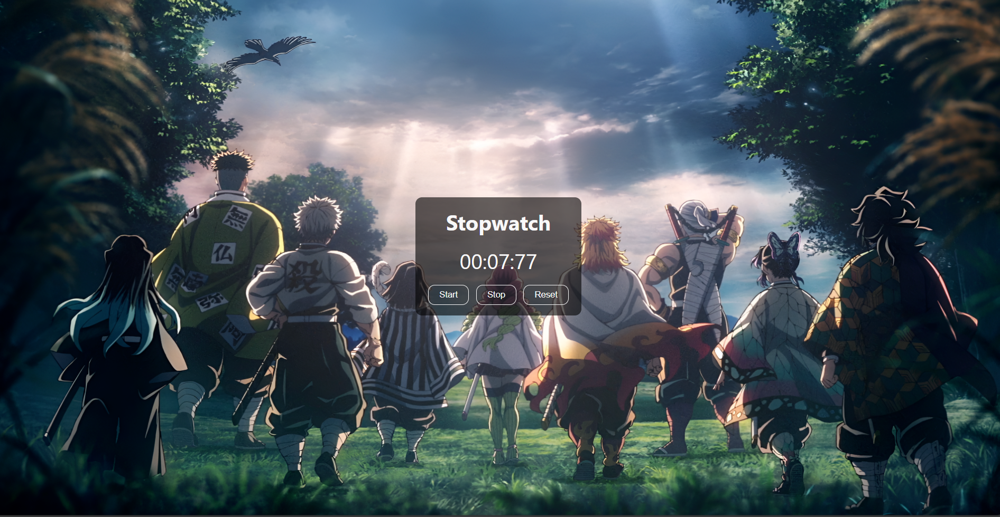

# Stopwatch Web Application

This project is a simple and responsive **Stopwatch** built using HTML, CSS, and JavaScript. It allows users to start, stop, reset, and record lap times, providing a functional and interactive time-tracking experience.

---

## Features

- **Start / Stop / Reset** – Basic stopwatch functionality.  
- **Lap Timer** – Record lap times while the stopwatch is running.  
- **Responsive Design** – Works on desktops, tablets, and mobile devices.  
- **Interactive UI** – Clean and user-friendly interface.

---

## Tech Stack

- HTML5  
- CSS3  
- JavaScript (ES6+)

---

## About

This stopwatch project was created to practice JavaScript and DOM manipulation. It demonstrates core front-end development skills and interactive functionality.  

Live demo: [https://abhaydutta.github.io/PRODIGY_WD_02/](https://abhaydutta.github.io/PRODIGY_WD_02/)

---

## Screenshot

